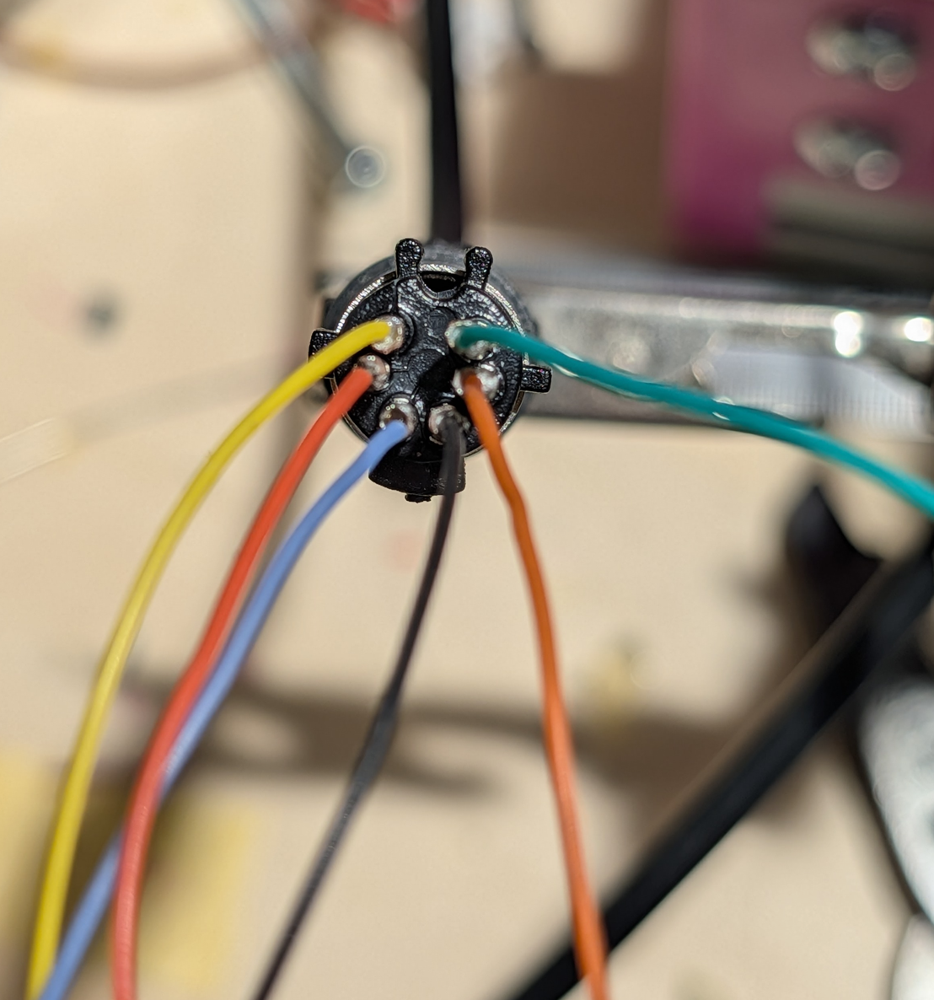

# Logitech Saitek Flight Throttle Quadrant ESP32 USB adapter
Usb adapter to connect Logitech / Saitek Flight Throttle Quadrant

This code is 100% generated by Google Antigravity - This is my first attempt to use this tool and this project is  like a proof of concept before more complex software.

The input information for antigravity was this forum: https://forum.arduino.cc/t/reverse-engineer-game-controller-with-custom-ps2-interface/564550
where aviator7 reversed engineered the communication protocol and pinout.

I asked antigravity to analyse the code and generate a more modern version for ESP32 S3 supermini dev board.
The code worked on first attempt.

Following section is also generated by antigravity:

# Wiring Guide: Saitek Yoke to ESP32 (Male Mini-DIN)

This guide details the connection between the male Mini-DIN connector of the Saitek Yoke cable and the ESP32-S3 Super Mini board.

## Pinout & Connections

The pin numbers below correspond to the standard **Male Mini-DIN-6** connector face (Pins facing you).

| Pin Position | Pin No. | Wire Color | Function | Connect to ESP32 Pin |
| :--- | :--- | :--- | :--- | :--- |
| **Bottom Left** | **1** | **Blue** | Clock (SCK) | **GPIO 5** |
| **Bottom Right** | **2** | **Black** | Ready | **GPIO 6** |
| **Middle Left** | **3** | **Red** | +5V | **5V** |
| **Middle Right** | **4** | **Orange** | GND | **GND** |
| **Top Left** | **5** | **Yellow** | Data (MISO) | **GPIO 4** |
| **Top Right** | **6** | **Green** | +5V | **5V** |

> [!NOTE]
> **Power**: Both Pin 3 (Red) and Pin 6 (Green) provide +5V. Connect them both to the ESP32 5V pin.

## Picture of minidin6 connector

This is the picture of the minidin6 / PS2 connector plugged into the cable for soldering:

# Flashing

If you don't want to compile the files by yourself, you can use the files in the release section
> These binaries are for the ESP32-S3 SuperMini board only !

| File | Adress |
| :--- | :--- |
| `bootloader.bin` | **`0x0000`** |
| `partitions.bin` | **`0x8000`** |
| `boot_app0.bin` | **`0xe000`** |
| `firmware.bin` | **`0x10000`** |
